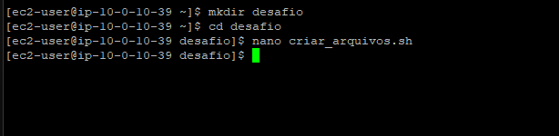

# 🏁 AWS re/Start — Desafio: Exercício de Shell Script em Bash

Laboratório de **desafio** do programa **AWS re/Start** em que, conectado por **SSH** a uma instância **Amazon Linux (EC2)**, escrevi um **script Bash** que cria lotes de **25 arquivos vazios** com **numeração crescente gerada automaticamente**, continuando de onde a execução anterior parou.


---

## 🎯 O desafio

Escrever um script Bash que:

1. **Crie 25 arquivos vazios** (0 KB), usando o `touch`
2. Nomeie os arquivos como `<nome><número>`, `<nome><número+1>`, `<nome><número+2>` e assim por diante
3. A **cada execução**, crie o **próximo lote de 25**, começando **depois do maior número já existente**
4. **Não** digite os números manualmente: eles devem ser **gerados por automação**
5. **Teste** o script e valide o resultado com uma **listagem longa** (`ls -l`) do diretório

## 🧠 Como pensei a solução

| Etapa | Ideia |
|---|---|
| 1. Preparar o ambiente | Criar o diretório de trabalho (sem erro se ele já existir) |
| 2. Descobrir onde parei | Percorrer os arquivos existentes e achar o **maior número** |
| 3. Criar o lote | Um laço de 25 repetições, criando `nome(MAX+1)` até `nome(MAX+25)` |
| 4. Informar | Mostrar quais arquivos foram criados |

> **Ideia central:** em vez de guardar o "último número" em algum lugar, o script **olha os próprios arquivos** para descobrir de onde continuar. Assim ele funciona mesmo se eu apagar arquivos ou rodar o script várias vezes.

---

## 💻 O script

```bash
#!/bin/bash
# Cria 25 arquivos vazios por execução, continuando a numeração do último lote.

NOME="werther"                 # prefixo dos arquivos
QTD=25                         # quantidade de arquivos por execução
DIR="$HOME/desafio_arquivos"   # diretório onde os arquivos serão criados

# Cria o diretório (se já existir, não dá erro) e entra nele
mkdir -p "$DIR"
cd "$DIR" || exit 1

# Descobre o maior número já usado nos arquivos <nome><número>
MAX=0
for f in "$NOME"[0-9]*; do
  [ -e "$f" ] || continue          # ignora se nenhum arquivo combinar
  N="${f#"$NOME"}"                 # remove o prefixo e fica só com o número
  [[ "$N" =~ ^[0-9]+$ ]] || continue
  (( 10#$N > MAX )) && MAX=$((10#$N))
done

# Cria o próximo lote, começando em MAX+1
for ((i = 1; i <= QTD; i++)); do
  touch "${NOME}$((MAX + i))"
done

echo "Criados ${QTD} arquivos: ${NOME}$((MAX + 1)) até ${NOME}$((MAX + QTD))"
```

### Como executar
```bash
chmod +x cria_arquivos.sh     # torna o script executável
./cria_arquivos.sh            # 1ª execução: cria 1 a 25
./cria_arquivos.sh            # 2ª execução: cria 26 a 50
ls -lv ~/desafio_arquivos     # listagem longa, em ordem numérica natural
```

### Resultado esperado

Testei o script rodando três vezes seguidas:

```
Criados 25 arquivos: werther1 até werther25
Criados 25 arquivos: werther26 até werther50
Criados 25 arquivos: werther51 até werther75
```

Ao final, o diretório tinha **75 arquivos, todos com 0 bytes**, de `werther1` até `werther75`, sem falhas nem repetições.

---

## 🔍 O que cada parte faz

### Variáveis no topo
`NOME`, `QTD` e `DIR` ficam no início para que eu possa **mudar o nome, a quantidade ou a pasta** em um lugar só, sem mexer na lógica.

### `mkdir -p "$DIR"` e `cd "$DIR" || exit 1`
- **`mkdir -p`** cria a pasta e **não dá erro se ela já existir**, importante porque o script roda várias vezes
- **`|| exit 1`** interrompe o script se não conseguir entrar na pasta, evitando criar arquivos no lugar errado

### O laço que acha o maior número
```bash
for f in "$NOME"[0-9]*; do
```
- O padrão `werther[0-9]*` pega arquivos que começam com `werther` seguido de um **dígito**
- **`[ -e "$f" ] || continue`**: se nenhum arquivo combinar (primeira execução), o Bash mantém o padrão literal, então esse teste **ignora** o caso
- **`${f#"$NOME"}`**: remove o prefixo e deixa só o número (`werther12` → `12`)
- **`[[ "$N" =~ ^[0-9]+$ ]]`**: confirma que sobrou **só número**, ignorando nomes como `werther5.txt`
- **`10#$N`**: força o Bash a ler o número em **base 10**, evitando que algo como `08` seja interpretado como octal e cause erro

### O laço que cria os arquivos
```bash
for ((i = 1; i <= QTD; i++)); do
  touch "${NOME}$((MAX + i))"
done
```
- Laço estilo C com contador `i` de 1 a 25
- **`$((MAX + i))`**: faz a conta aritmética e gera o número do arquivo
- **`touch`** cria cada arquivo vazio (0 KB)

---

## 🧠 O que eu aprendi

- **Laços `for`** (de lista de arquivos e de contagem) e **aritmética** com `$(( ))` e `(( ))`
- **Expansão de padrões** (`werther[0-9]*`) e como o Bash se comporta quando **nenhum arquivo combina**
- **Manipulação de texto em variáveis** (`${f#"$NOME"}`) para extrair o número do nome
- **Expressões regulares** básicas com `[[ ... =~ ... ]]`
- **Scripts idempotentes e reexecutáveis**: o resultado depende do estado atual, e não de um valor fixo
- **Tratamento de erros simples** com `|| exit 1` e `|| continue`
- Que o `ls` ordena **alfabeticamente** (`werther1`, `werther10`, `werther11`...). Para ver em ordem numérica, usei **`ls -v`**

## ✅ Boas práticas que levo daqui

- **Colocar valores configuráveis em variáveis** no começo do script
- **Entre aspas** as variáveis (`"$DIR"`, `"$f"`) para evitar problemas com espaços
- **Não repetir números à mão**: deixar o script descobrir o estado atual
- **Testar várias execuções seguidas** para garantir que a lógica é estável
- **Comentar o código** para facilitar a manutenção
- **Encerrar o laboratório** ao final para liberar os recursos

---

## 📸 Evidências




## 📚 Próximos passos

- Receber **nome e quantidade como parâmetros** (`$1` e `$2`) em vez de fixá-los
- Usar `printf` para criar nomes com **zeros à esquerda** (`werther001`)
- Adicionar **validações** (`if`) e mensagens de erro mais claras
- Agendar o script no **cron** e registrar a execução em um **log**
- Documentar os próximos labs do re/Start neste repositório

---

## 👤 Autor

**Werther Crisley**
🔗 [GitHub](https://github.com/WertherCrisley)